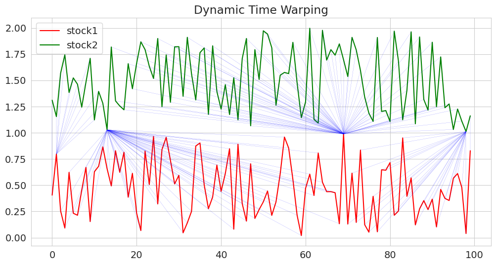

# Stock Clustering of S&P 500 and NASDAQ 100 Constituents for Investment Strategy Optimisation

[](https://github.com/nenuadrian/msc-business-analytics-dissertation/actions/workflows/latex.yml)

## Overview

This project dives deep into advanced clustering techniques, aiming to reveal the hidden patterns and correlations woven into the stock prices of S&P 500 and NASDAQ 100 companies. We move beyond the limitations of traditional methods by employing Dynamic Time Warping (DTW) and Self-Organising Maps (SOM) to provide investors with unique and actionable insights. 



## Objectives

This project pursues three core objectives.  First, it  analyzes historical stock data, employing clustering techniques to unearth hidden patterns in stock price movements. Second, it seeks to optimize investment strategies by identifying stocks with similar behaviors, leading to better-informed investment decisions. Finally, it rigorously evaluates the effectiveness of various clustering methods, comparing Euclidean-based and DTW-based approaches to determine the most suitable technique for this domain. 

## Methodologies

### Clustering Techniques

This research employs a triad of powerful clustering techniques: K-Means (with both Euclidean and DTW distance metrics), Hierarchical Clustering (using DTW), and Self-Organising Maps (MiniSom).  K-Means, in its standard form and with the added dimension of time warping, groups stocks based on their historical price performance, capturing both linear and non-linear relationships. Hierarchical Clustering with DTW generates flat clusters derived from a distance matrix and presents visual dendrograms for in-depth analysis. Finally, Self-Organising Maps (MiniSom), a neural network-based approach, offers a robust solution for clustering high-dimensional stock data, revealing intricate connections.

### Data Processing

To ensure a fair comparison and extract meaningful insights, the stock price data undergoes normalization using MinMax scaling. The temporal analysis focuses on a specific time frame, carefully chosen to avoid biases introduced by external market shocks such as the COVID-19 pandemic.

### Evaluation Metrics

The performance of these clustering techniques is rigorously evaluated using a suite of metrics: Silhouette Score, Calinski-Harabasz Index, and Davies-Bouldin Index. The Silhouette Score provides a measure of how similar a stock is to its assigned cluster in comparison to other clusters, offering insights into the cohesiveness of the groupings. The Calinski-Harabasz Index assesses the ratio of variance within clusters to the variance between clusters, providing a measure of cluster separation and compactness. The Davies-Bouldin Index evaluates the average similarity between clusters, with lower values indicating better-defined and separated clusters.

## Results

The research reveals that while Euclidean K-Means provides a good foundation for clustering, DTW-based methods demonstrate a superior ability to capture asynchronous similarities in stock price movements, leading to improved pattern recognition. MiniSom also proves its effectiveness in clustering high-dimensional stock data, offering valuable insights into complex relationships.

## Future Work

This research lays the groundwork for exciting future explorations. We plan to delve into backtesting our clustering-informed strategies and assess their impact on portfolio performance. We also aim to enrich our models by incorporating additional features, such as trading volume and other financial metrics, to enhance their predictive power. Finally, we will investigate methods to improve the robustness of our models in the face of market volatility, ensuring their adaptability to dynamic market conditions.

## Technology Stack

This project leverages the versatility of Python and JavaScript as its primary programming languages. It utilizes powerful libraries like Pandas, NumPy, Scikit-learn, Tslearn, Plotly, Matplotlib, and Seaborn for data manipulation, analysis, and visualization. The project is developed and executed on Google Cloud Platform and Google Colaboratory, taking advantage of their scalable infrastructure and collaborative environment.

# Cite

```
@article{dtwStockClustering,
	author = {Adrian Nenu and Sheik Meeran},
	title = {{Stock Clustering of S\&P 500 and NASDAQ 100 Constituents for Investment Strategy Optimisation}},
  url = {https://github.com/nenuadrian/msc-business-analytics-dissertation},
  year = 2023,
}
```
